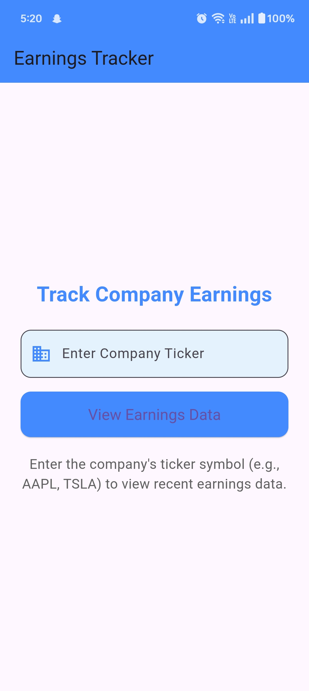
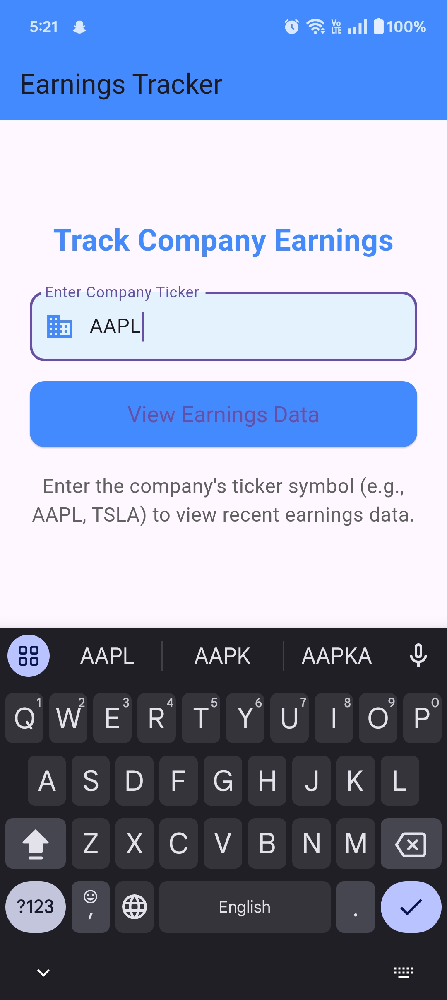
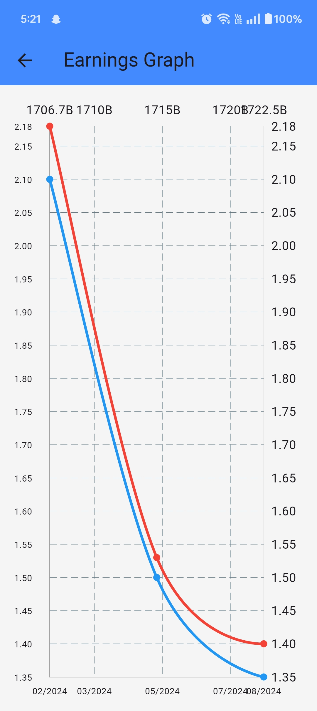
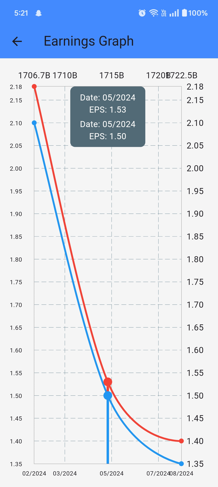
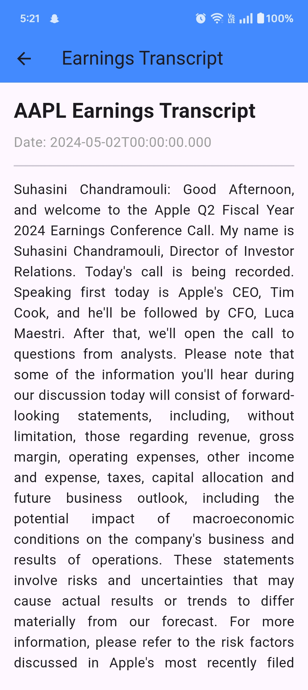

# Earnings Tracker

A Flutter application that provides users with an interactive earnings graph and access to earnings transcripts for different companies. This app utilizes an API to fetch earnings data and transcripts, allowing users to easily track company performance over time.

## Features

- **Interactive Graph**: Visualize estimated and actual earnings using a line graph.
- **Earnings Transcripts**: Access earnings call transcripts for detailed insights.
- **User-Friendly Interface**: Simple navigation and input for company tickers.
- **Scrollable Transcript**: Easily read through earnings transcripts with a scrollable text view.

## Technologies Used

- Flutter
- Dart
- Provider package for state management
- fl_chart package for graph visualization
- http package for API calls
- intl package for date formatting

## Installation

1. Clone the repository:

   ```bash
   git clone https://github.com/yourusername/earnings_tracker.git

## Instructions 

- Replace the API Key with your own correct **API Key** from api-ninjas in **api_service.dart** file.

## Screens

<div style="display: flex; flex-wrap: wrap; justify-content: space-between;">      </div> ```